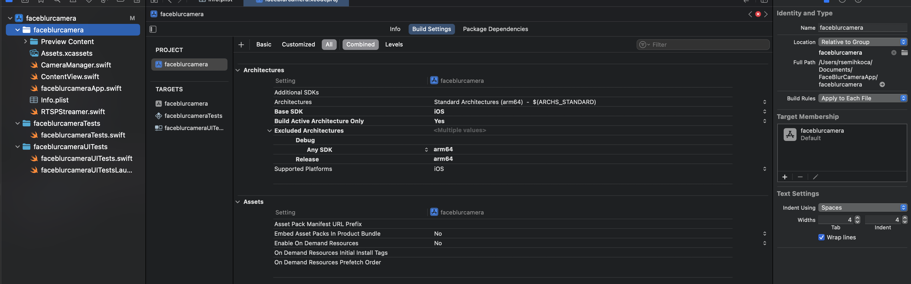

# FaceBlurCameraApp

bana bir ios uygulaması yapmanı istiyorum.

bu ios uygulamasında 2k olacak şekilde bellir bir fps'te görüntüleri alıp rtsp üzerinden yayın yapmanı istiyorum.

sadece bir adet arka kamera kullanılacak.

kamera özelliklerinin konfigüratif olmasını istiyorum.

fps'in de konfigürasyon olarak değiştirilebilmesi gerekiyor.

rtsp 8554 portunda çalışsın admin admin olarak basic auth kullan

ayarlar menüsünde 
    - fps
    - kameranın çözünürlüğü,
    - white balance
    - exposure
    - focus
    - zoom
    - flash
    - auto focus
    - auto exposure
    - auto white balance

ayarları olmalı

uygulama açılınca rtsp yayını başlatılacak. ve ekranda yatay olarak görüntüleri gösterecek.

rm -rf ~/Library/Developer/Xcode/DerivedData/faceblurcamera-*

## Executable path is directory:
faceblurcamera üzerine geldim folder olan, build rules each file yaptım ve target membership'i faceblurcameraApp yaptım.

copy bundle resources'tan info.plist'i çıkarttım.

compile sources'ta normalde swift paketlerini görmezken bu şekilde görüyorum.
hatta copy bundle resources da görüyorum. assets.xcassets 
